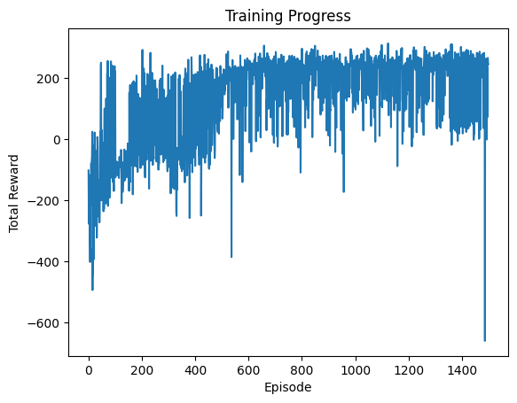
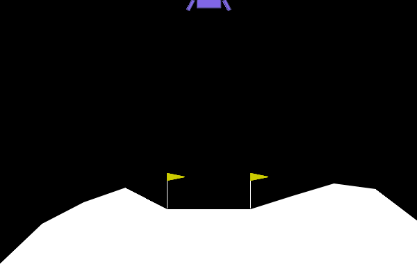

# Lunar Lander – Deep Q-Learning in Action

This project implements a Deep Q-Network (DQN) agent trained to solve the `LunarLander-v3` environment using reinforcement learning techniques. Built with PyTorch and Gymnasium, the agent learns to land a simulated spacecraft safely through trial and error, guided by reward signals.

## Overview

- Environment: `LunarLander-v3` (Gymnasium)
- Agent: Deep Q-Network (DQN)
- Frameworks: PyTorch, NumPy, Matplotlib
- Visualizations: Training curves and animated landings (GIF)

The model learns through interaction with the environment, stores experiences in a replay buffer, and updates Q-values using the Bellman equation with target network stabilization.

## Training Graph



## Final Result

The trained agent successfully performs soft landings on the moon-like surface.



## DQN Architecture

```python
class DQN(nn.Module):
    def __init__(self, state_size, action_size, hidden_size):
        super(DQN, self).__init__()
        self.fc1 = nn.Linear(state_size, hidden_size)
        self.fc2 = nn.Linear(hidden_size, hidden_size)
        self.fc3 = nn.Linear(hidden_size, action_size)

    def forward(self, x):
        x = F.relu(self.fc1(x))
        x = F.relu(self.fc2(x))
        return self.fc3(x)
```

## Hyperparameters

```python
HYPERPARAMS = {
    "BATCH_SIZE": 128,
    "GAMMA": 0.99,
    "EPS_START": 1.0,
    "EPS_END": 0.05,
    "EPS_DECAY": 1000,
    "TAU": 0.005,
    "LR": 1e-4,
    "REPLAY_MEMORY_SIZE": 10000,
    "HIDDEN_LAYER_SIZE": 128,
    "NUM_EPISODES": 500,
    "TARGET_UPDATE_INTERVAL": 10,
    "MAX_STEPS_PER_EPISODE": 500,
    "GIF_FPS": 30
}
```

## Lessons Learned

This project offered practical experience in building a reinforcement learning pipeline from scratch:
- Managing exploration and exploitation
- Stabilizing learning with target networks
- Tuning hyperparameters for convergence
- Visualizing training behavior and agent performance

## Acknowledgments

Built as part of the Build Fellowship project under the guidance of Igor Sadalski.
